# Spoolwise

A self-hosted web app to manage 3D print orders, filament inventory, costs and business statistics.

**Stack:** Python 3.12 · Flask 3 · Bootstrap 5 (Bootswatch Flatly) · MariaDB 11 · Docker

---

## Screenshots

| Light | Dark |
|---|---|
| 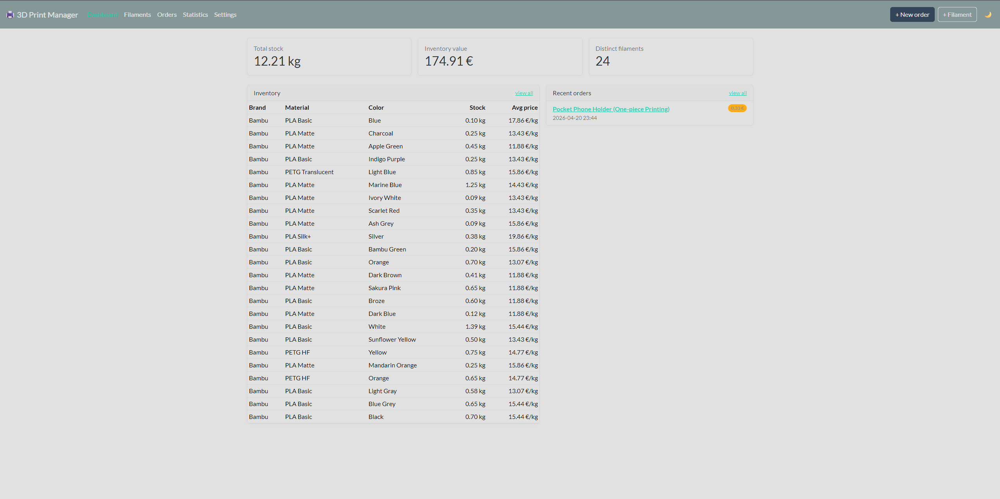 | 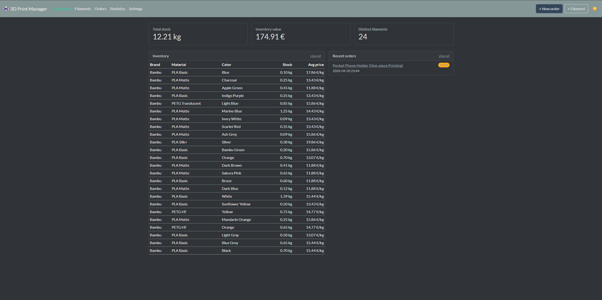 |
| 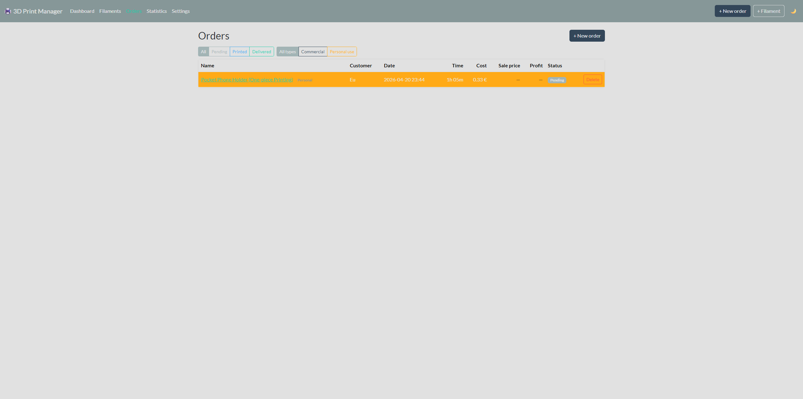 | 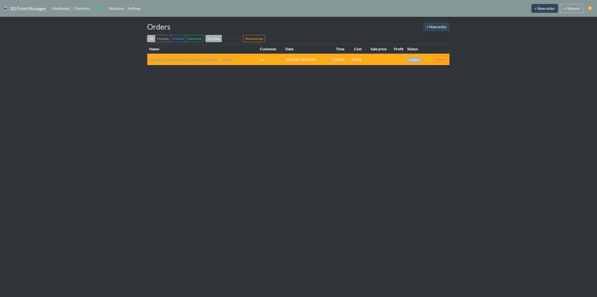 |
| 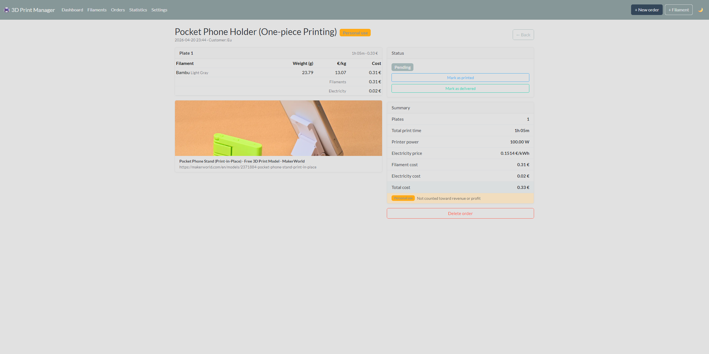 | 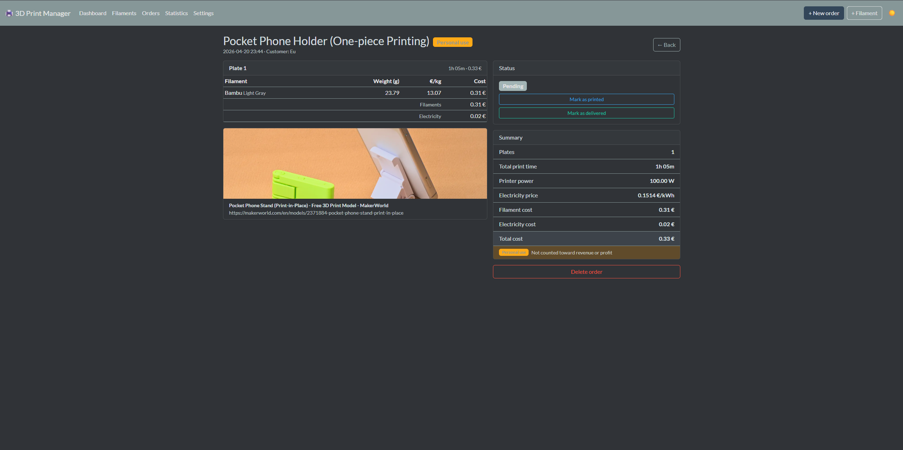 |
| 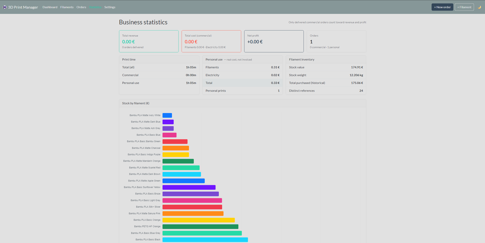 | 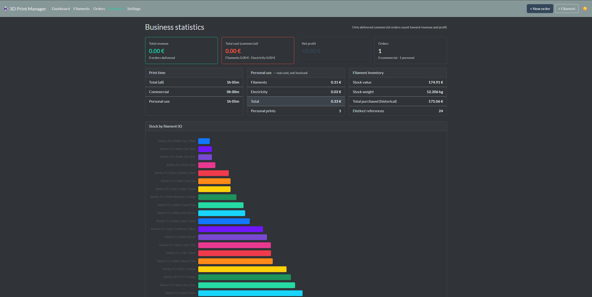 |
| 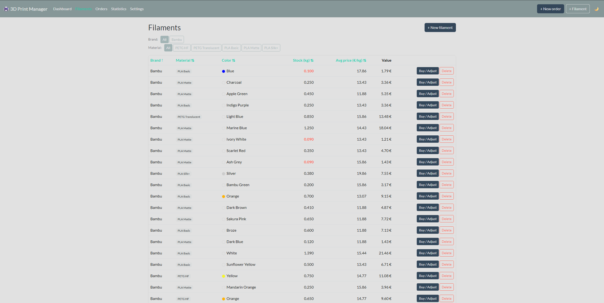 | 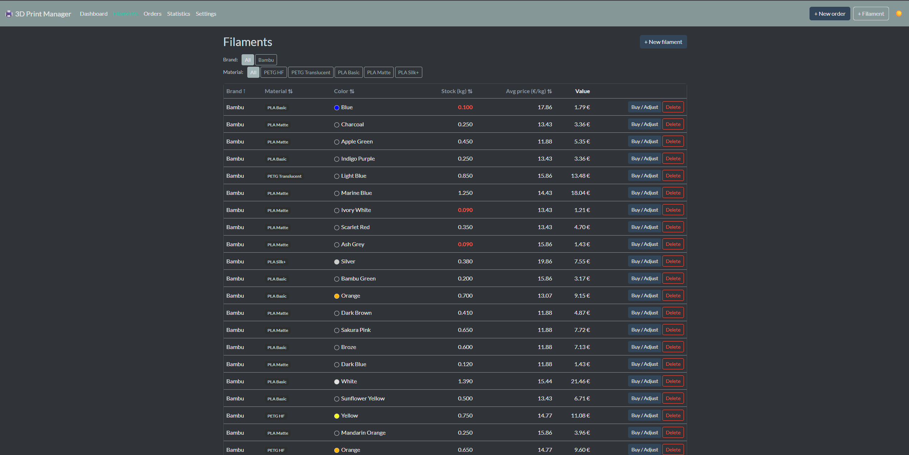 |
| 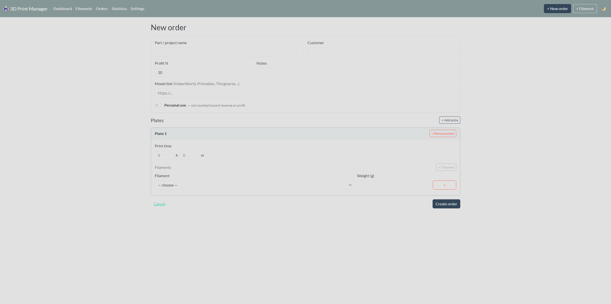 | 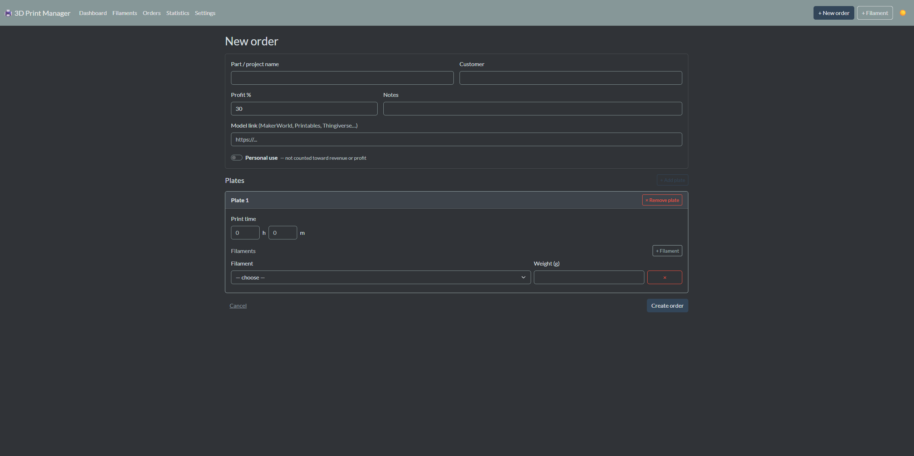 |
| 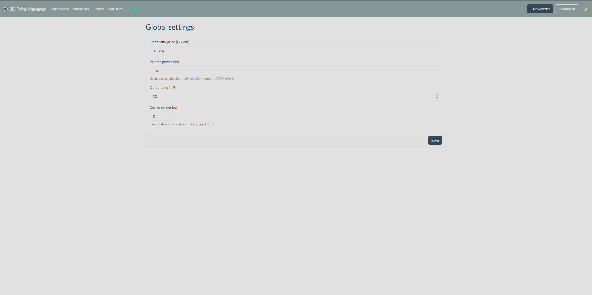 | 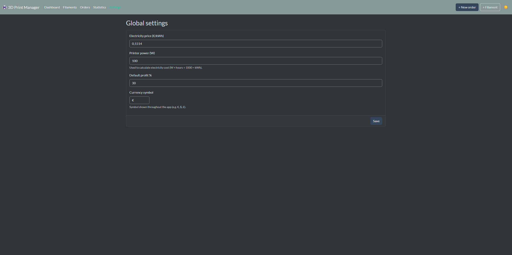 |

---

## Features

| Area | Details |
|---|---|
| **Filament inventory** | Stock in grams, weighted-average price recalculated on every purchase |
| **Multi-plate orders** | Each plate has its own print time and filaments (multi-colour supported) |
| **Cost calculation** | Filament cost + electricity cost → total cost → sale price with configurable profit % |
| **Price snapshots** | Prices are captured at order creation — historical costs never drift |
| **Stock tracking** | Auto-deducted on order creation, restored on deletion; manual adjustment available |
| **Personal use flag** | Track your own prints without polluting revenue and profit stats |
| **Statistics** | Revenue, cost, profit, monthly breakdown, filament stock charts (Chart.js) |
| **Model preview** | Paste a MakerWorld / Printables / Thingiverse URL → title and cover image fetched automatically |
| **Currency** | Configurable symbol in Settings (default `€`) |
| **Dark / light mode** | Toggle in the navbar, persisted in `localStorage` |
| **Multi-user** | Per-user data isolation; admin-managed accounts; optional Authelia/SSO via trusted proxy headers |
| **Retail mode** | Optional VAT on orders, per-order quantity, multi-order combined quotes, VAT-collected stats |

---

## Getting started

### Prerequisites

- [Docker](https://docs.docker.com/get-docker/) and Docker Compose v2

### 1. Clone and configure

```bash
git clone https://github.com/nunobifes/spoolwise.git
cd spoolwise
cp .env.example .env
```

Edit `.env` with your own values:

```env
MARIADB_ROOT_PASSWORD=your_root_password
MARIADB_USER=printing
MARIADB_PASSWORD=your_db_password
DATABASE_URL=mysql+pymysql://printing:your_db_password@db:3306/printing_app
SECRET_KEY=a_long_random_secret

# Auth — single-user / local mode (default)
TRUST_PROXY_AUTH=false
ADMIN_USERNAME=admin
ADMIN_PASSWORD=change_me_on_first_login
ADMIN_EMAIL=
```

> If `ADMIN_PASSWORD` is left empty on first start, the app generates a random
> password and prints it once to the container logs. Change it after logging in.

### 2. Start

```bash
docker compose up -d
```

The app waits for MariaDB to be healthy before starting, then creates all tables automatically.

| Service | URL / host |
|---|---|
| Web app | http://localhost:5000 |
| MariaDB | `localhost:3306` (external port) |

### 3. First run

1. Open http://localhost:5000/settings and set your electricity price, printer wattage and default profit %.
2. Go to **Filaments → + New filament** and add your spools.
3. Create your first order with **+ New order**.

---

## Docker Compose reference

```yaml
services:
  db:
    image: mariadb:11
    restart: unless-stopped
    environment:
      MARIADB_ROOT_PASSWORD: ${MARIADB_ROOT_PASSWORD}
      MARIADB_DATABASE: printing_app
      MARIADB_USER: ${MARIADB_USER}
      MARIADB_PASSWORD: ${MARIADB_PASSWORD}
    ports:
      - "3306:3306"
    volumes:
      - db_data:/var/lib/mysql
    healthcheck:
      test: ["CMD", "healthcheck.sh", "--connect", "--innodb_initialized"]
      interval: 5s
      retries: 10

  app:
    image: nunobifes/spoolwise
    restart: unless-stopped
    depends_on:
      db:
        condition: service_healthy
    environment:
      DATABASE_URL: ${DATABASE_URL}
      SECRET_KEY: ${SECRET_KEY}
    ports:
      - "5000:5000"

volumes:
  db_data:
```

---

## Running without Docker (development)

```bash
# Start only the database
docker compose up -d db

# Set up Python environment
python -m venv .venv
source .venv/bin/activate          # Windows: .venv\Scripts\activate
pip install -r requirements.txt

# Configure
cp .env.example .env               

# Run
python run.py
```

---

## Deploying with Portainer

1. In Portainer, go to **Stacks → + Add stack**.
2. Paste the contents of `docker-compose.yml`.
3. Under **Environment variables**, add all variables from `.env.example` with your values.
4. Click **Deploy the stack**.

To update after a new image is pushed to Docker Hub:  
**Stacks → your stack → Editor → Update the stack** (Portainer pulls the latest image).

---

## Retail mode (VAT, quantity, combined quotes)

Spoolwise can run in a **retail mode** for users selling to businesses (e.g.
a Portuguese self-employed seller invoicing a local store). When enabled:

- **Quantity per order.** An order can produce N identical units. Cost,
  print time and stock deduction all scale by quantity.
- **Optional VAT per order.** The order form gets an "Apply VAT" toggle and
  a rate field. The VAT rate is snapshotted at creation, so changes to the
  default rate later won't rewrite history. VAT is excluded from `profit`
  (it's owed to the state, not income).
- **Combined quotes.** Tick checkboxes on the orders list to select multiple
  orders, then click *Generate combined quote* to get a single printable
  page with line items per order plus aggregate subtotal, VAT and total.
  Mixed VAT/no-VAT and mixed VAT rates are handled.
- **Stats.** A "VAT collected" KPI plus a retail / particular revenue split,
  and a per-month VAT column.
- **Stock policy.** Stock validation is *warn-but-allow*: an order with a
  quantity that exceeds available stock is created anyway and goes into
  negative; a flash message reminds you to top up inventory.

Toggle in **Settings → Retail mode**. While off, none of the above is
visible and the app behaves as before. Existing orders default to
`quantity=1` and no VAT.

The default VAT rate (used to pre-fill new orders) is configurable in
Settings — set to your country's standard rate (Portugal: 23).

---

## Multi-user

Spoolwise supports multiple users with full per-user data isolation. Filaments,
purchases and orders are scoped to the user that created them; settings
(electricity price, printer wattage, currency, default profit %) are global.

**Account management:**
- The first time the app starts, an admin user is created from
  `ADMIN_USERNAME` / `ADMIN_PASSWORD` / `ADMIN_EMAIL`. If `ADMIN_PASSWORD` is
  not set, a random password is generated and logged once to stdout.
- Public registration is disabled. The admin manages users from
  **Avatar → Manage users** (`/admin/users`): create, deactivate, reset
  password, delete.
- All existing data on upgrade is assigned to the bootstrap admin.

---

## Authelia + SWAG setup (reverse-proxy SSO)

When exposing Spoolwise publicly behind [SWAG](https://docs.linuxserver.io/general/swag/)
or any reverse proxy that performs Authelia auth_request, set:

```env
TRUST_PROXY_AUTH=true
TRUSTED_PROXY_IPS=172.18.0.0/16   # your docker network or proxy IP(s)
```

By default this runs in **hybrid mode**: requests that arrive with a
`Remote-User` header from a trusted proxy are auto-logged-in, and direct
requests (e.g. `http://<server-ip>:5000` from your LAN) still see the
native `/login` form. This lets you keep direct LAN access while exposing
the public hostname behind Authelia.

To lock down to **strict SSO** (form disabled, identity must come from the
proxy), also set:

```env
DISABLE_LOCAL_LOGIN=true
```

The app reads identity from these request headers, set by Authelia and
forwarded by SWAG:

| Header         | Purpose                                  |
|----------------|------------------------------------------|
| `Remote-User`  | Username (used as the local account key) |
| `Remote-Email` | Email (optional)                         |
| `Remote-Name`  | Display name (optional)                  |
| `Remote-Groups`| Comma-separated groups — drives admin status |

If a request arrives with `Remote-User: alice` and no local user `alice`
exists, the account is auto-created. Email and display name follow whatever
Authelia sends.

**Admin promotion via groups.** On every request, the app reads
`Remote-Groups` and sets `is_admin = True` if the configured admin group
(env `ADMIN_GROUP`, default `admins`) appears in the list. Add or remove a
user from that group in Authelia and Spoolwise mirrors it on the next
request — no manual promotion needed. If the proxy does not send
`Remote-Groups` at all, the admin flag is left unchanged.

**SWAG nginx snippet** (e.g. `/config/nginx/proxy-confs/spoolwise.subdomain.conf`):

```nginx
server {
    listen 443 ssl;
    listen [::]:443 ssl;
    server_name spoolwise.*;

    include /config/nginx/ssl.conf;

    # Spoolwise allows up to 150 MB uploads (3MF files).
    client_max_body_size 200M;

    include /config/nginx/authelia-server.conf;

    location / {
        # auth_request to Authelia + forwards Remote-User/Email/Name/Groups
        # headers automatically. Do NOT add proxy_set_header Remote-* below
        # — this include already does it. Setting them again would result
        # in duplicate headers concatenated with a comma by WSGI, breaking
        # username matching.
        include /config/nginx/authelia-location.conf;
        include /config/nginx/proxy.conf;

        set $upstream_app spoolwise;   # docker container name, OR an IP
        set $upstream_port 5000;
        set $upstream_proto http;
        proxy_pass $upstream_proto://$upstream_app:$upstream_port;
    }
}
```

If your reverse proxy does **not** auto-forward `Remote-*` headers from the
auth_request response (some setups need this added manually), uncomment and
add inside `location /`:

```nginx
auth_request_set $user   $upstream_http_remote_user;
auth_request_set $email  $upstream_http_remote_email;
auth_request_set $name   $upstream_http_remote_name;
auth_request_set $groups $upstream_http_remote_groups;
proxy_set_header Remote-User   $user;
proxy_set_header Remote-Email  $email;
proxy_set_header Remote-Name   $name;
proxy_set_header Remote-Groups $groups;
```

But only if `authelia-location.conf` does not already emit those headers — check the include first.

**Authelia `configuration.yml`** — add an access-control rule:

```yaml
access_control:
  rules:
    - domain: spoolwise.example.com
      policy: two_factor   # or one_factor
```

Defense-in-depth: `TRUSTED_PROXY_IPS` restricts the IPs from which `Remote-*`
headers are honoured. If a request comes from any other source those headers
are ignored. Leave empty only if you fully trust your network path.

---

## CI/CD

Pushing to `main` triggers a GitHub Actions workflow (`.github/workflows/docker.yml`) that builds the Docker image and pushes it to Docker Hub as `nunobifes/spoolwise:latest`.

**Required repository secrets** (GitHub → Settings → Secrets and variables → Actions):

| Secret | Value |
|---|---|
| `DOCKERHUB_USERNAME` | Your Docker Hub username |
| `DOCKERHUB_TOKEN` | Docker Hub access token (Account Settings → Security → New Access Token) |

---

## Cost model

Per-unit values come from the plates; order-level totals multiply by `quantity`:

```
unit_filament_cost    = Σ (weight_g / 1000 × avg_price_per_kg)   [snapshotted at order creation]
unit_electricity_cost = (printer_watts / 1000) × print_hours × price_per_kwh
unit_cost             = unit_filament_cost + unit_electricity_cost

total_cost            = unit_cost × quantity
sell_price            = total_cost × (1 + profit_pct / 100)        [excl. VAT]
profit                = sell_price − total_cost                    [VAT not included]

# Retail mode only:
vat_amount            = sell_price × vat_rate_pct / 100
sell_price_with_vat   = sell_price + vat_amount
```

`quantity` defaults to 1 when retail mode is off, so the formulas
collapse back to per-order values.

Weighted-average price on new filament purchase:

```
new_avg = (current_stock_kg × current_avg + purchase_kg × purchase_price)
          ─────────────────────────────────────────────────────────────────
                          (current_stock_kg + purchase_kg)
```

---

## Project structure

```
spoolwise/
├── app/
│   ├── __init__.py       # app factory, DB retry loop, additive migrations
│   ├── models.py         # SQLAlchemy models and business logic
│   ├── routes.py         # all routes (single blueprint)
│   └── templates/        # Jinja2 templates
├── .env.example          # environment variable template
├── .github/workflows/    # CI/CD (Docker Hub push on push to main)
├── docker-compose.yml
├── Dockerfile
├── requirements.txt
└── run.py
```

---

## License

MIT
